# ai-agents-auth-demo

End-to-end demo of **authentication and authorization for AI agents** on
Kubernetes. A DevOps/SRE copilot reads observability data and restarts
workloads on a user's behalf — and every hop is authenticated, least-privilege,
MFA-gated where it matters, and fully traceable.

Built with:

- **Curity Identity Server** — the sole OAuth/OIDC token issuer.
- **SPIFFE / SPIRE** — per-workload cryptographic identity (JWT-SVIDs).
- **Istio Ambient Mesh** — transparent ztunnel L4 mTLS for in-mesh traffic.
- **One shared root CA** — istiod (Istio plug-in `cacerts`) and SPIRE (disk
  `UpstreamAuthority`) run intermediates under a single cluster root, so all
  mesh certs and SVIDs chain to one trust anchor.
- **Vercel AI SDK** (TypeScript) agents; **A2A** for agent-to-agent calls; **MCP**
  (Streamable HTTP) for tool invocation.
- **agentgateway** — a standalone MCP front door (JWT + per-tier scope authz +
  `tools/list` filtering) whose co-located `exchange-shim` sidecar runs the
  per-backend RFC 8693 OBO exchange for every tool call. It is **also the LLM
  egress gateway**: both agents exchange for `aud=llm-gateway`/`scope=llm:invoke`
  and call its OpenAI-compatible `/llm` route, which holds the only upstream LLM
  provider key in the system — the agents never possess it. The provider itself is
  pluggable (OpenAI, Anthropic, Gemini, Azure OpenAI) — see
  [`docs/llm-providers.md`](docs/llm-providers.md).
- **OpenTelemetry → Tempo → Grafana** — identity-decorated distributed tracing.
- Modern OAuth standards: **RFC 8693** (token exchange), **RFC 9470** (step-up),
  **RFC 9728** (protected-resource metadata), and **CIMD** (Client ID Metadata
  Documents) + **RFC 7523** `private_key_jwt` — the agents authenticate as
  ephemeral clients with no shared secret.

## The idea in one paragraph

The user logs in once. Each agent and tool authenticates as *itself* with a
SPIFFE identity and **exchanges** the user's token (RFC 8693) for a new token
scoped to exactly the next hop — recording itself in a nested `act` chain as it
goes. The service that finally touches the cluster can prove on whose behalf and
through which agents the request arrived, require MFA for privileged actions,
and deny by role. Three identity planes — **human** (OIDC), **workload**
(SPIFFE), and **assurance** (MFA) — enforced together, visible in one trace.

```
Browser ─https─▶ web (BFF) ─user token─▶ agent-copilot ─┬─ MCP ─▶ agentgateway ─▶ mcp-inspect ─▶ inspect-api ─▶ K8s
                                                        ├─ LLM ─▶ agentgateway ─▶ LLM provider
                                                        └─ A2A ─▶ agent-specialist ─┬─ MCP ─▶ agentgateway ─▶ mcp-ops          ─▶ ops-api ─▶ K8s
                                                                                    ├─ MCP ─▶ agentgateway ─▶ mcp-inspect ─▶ inspect-api ─▶ K8s
                                                                                    └─ LLM ─▶ agentgateway ─▶ LLM provider
              agentgateway = MCP front door (aud=mcp-gateway; per-tier scope authz + tools/list filter; extAuthz→exchange-shim OBO hop)
                           + LLM egress   (/llm; aud=llm-gateway + scope=llm:invoke; injects the only provider key — no shim, no act-chain)
              every agent/MCP hop ⇄ Curity (RFC 8693 exchange, SPIFFE actor_token)
```

<a href="docs/architecture.jpg"></a>

<sub>Animated: the login, then the read path (lilac) and the privileged path (amber). Each namespace's JWT-SVID drops from SPIRE as the request reaches it, and each hop exchanges its token at Curity. Click for the static diagram; regenerate with `python3 scripts/render-architecture-svg.py`.</sub>

See [`docs/architecture.md`](docs/architecture.md) for the full picture.

## Tested on

| | Verified | Notes |
|---|---|---|
| **Host OS** | macOS with Docker Desktop | Linux is untested but nothing is Mac-specific beyond the `brew` hints. |
| **LLM provider** | **Azure OpenAI** (`LLM_PROVIDER=azure`, the default) and **Anthropic** (`LLM_PROVIDER=anthropic`, `claude-sonnet-4-6`) | Both driven end to end — copilot answers, specialist restarts, `make smoke-llm`. The OpenAI and Gemini fragments are schema-validated against the pinned agentgateway image only, not driven against the live vendor — see [`docs/llm-providers.md`](docs/llm-providers.md#3-which-is-verified). |
| **Footprint** | Single-node KIND; give Docker about **30 GB of disk** | `make demo` takes about **10 minutes** end to end on a fresh machine, most of it is image builds; it shows one status line per phase (full output goes to `.demo-logs/`) with its duration, and ends with an *Installation complete* banner. Ports **80 and 443** on localhost must be free for the Istio ingress. |

## Prerequisites (macOS)

You need **Docker running** (Docker Desktop), a few CLIs, a Curity
developer license, and an API key for one supported LLM provider (OpenAI,
Anthropic, Gemini, or Azure OpenAI).

```bash
# 1. CLIs via Homebrew (Node 22+ is required; python3 is used only by the host-side
#    embed/render/smoke scripts; qrencode is optional and turns the TOTP URIs into QR codes).
brew install node kind kubectl helm mkcert python qrencode

# 2. pnpm — NO separate install. It ships with Node via corepack:
corepack enable          # provisions the repo-pinned pnpm (9.15.0)

# 3. Verify the toolchain (node>=22, pnpm, docker, kind, kubectl, helm, mkcert, python3):
make tools-check
```

Two things `make tools-check` can't check for — have them ready before `make demo`:

- **Curity developer license** — free from the [Curity developer portal](https://developer.curity.io);
  save it as `./license.json` at the repo root (gitignored).
- **An LLM provider API key** — the agents' reasoning runs on it, so without it
  they can't respond. Pick one of `openai`, `anthropic`, `gemini` or `azure` when prompted
  Switching provider later, run `make configure-llm` — see
  [`docs/llm-providers.md`](docs/llm-providers.md).

`make demo` generates the local mkcert CA (via `make certs`) but, by default,
does **not** register it in your macOS keychain / browser trust store — so the
browser will warn on `https://app.localtest.me` (safe to proceed for a localhost
demo). The in-cluster TLS works regardless. To trust the CA and silence the
warnings, run `make trust-ca` (undo anytime with `mkcert -uninstall`).

## Quick start

```bash
# 1. Clone the repo and cd into it:
git clone https://github.com/curityio/ai-agents-auth-demo.git
cd ai-agents-auth-demo

# 2. Put your Curity license at the repo root (gitignored); make demo will
# otherwise prompt and wait for it:
cp /path/to/your/curity-license.json ./license.json

make demo            # one command, end to end. Prompts up front for the license
                     # file + LLM provider key, then runs unattended:
                     # kind + Istio Ambient + SPIRE + telemetry, seeds every
                     # secret, builds/loads images, applies manifests, wires routing.

# make demo finishes by printing every browser-exposed URL (app, Curity admin,
# Grafana, plus the OAuth/SPIFFE metadata endpoints) and one card per demo persona
# (username, role, password, otpauth URI + QR code). Re-print anytime:
make urls
make users

# alice, carol & bob (password Password1) are seeded into Curity automatically, TOTP
# included. Scan their QR codes into your authenticator app once — the secrets live in
# the gitignored .demo-users.env and survive rebuilds — then sign in
# (docs/curity-seed.md §Accounts):
open https://app.localtest.me
```

Once signed in, the app makes the identity plumbing visible on screen: the
header pill shows the current token's `acr` and counts down its 10-minute
lifetime; the Result card links each answer to its OpenTelemetry trace in
Grafana; and three on-demand panels show the live SPIFFE JWT-SVIDs of the
workloads in the flow you just ran, the **on-behalf-of chain** as a ledger
(every token diffed against the one it was exchanged from, `may_act` naming
the next permitted actor), and the MCP tools agentgateway lists for *your*
token per tier.

## Common workflows

```bash
# Day-to-day cluster ops
make urls            # print every browser-exposed URL (apps + metadata endpoints)
make users           # print the demo personas: username, role, password, TOTP QR code
make image-web       # rebuild + load ONE image (or: make images IMAGES="web mcp-ops");
                     # then restart the deployments it prints — pods keep the old :dev image
make status          # pod health across all namespaces
make routing         # re-wire pod→Curity routing (after cluster recreation)
make doctor          # Docker + KIND disk audit
make clean           # tear it all down
make reset           # tear down + reclaim docker build cache (ENOSPC recovery)

# One-time per clone: install the pre-commit guard that blocks accidentally
# committing the Curity license or the LLM API key.
make hooks
```

`make help` lists every target. The Makefile is the single authoritative
lifecycle entry point — environment setup, platform install, deploy, validation,
and teardown.

## Repository layout

```
apps/
  web/                  # Next.js BFF + Auth.js (Curity OIDC)
  agent-copilot/        # front-line agent (Vercel AI SDK); CIMD ephemeral client
  agent-specialist/     # privileged agent; A2A server; CIMD ephemeral client
  mcp-inspect/    # read-tier MCP (thin client → inspect-api)
  mcp-ops/              # privileged-tier MCP (thin client → ops-api; sre-only set_deployment_image)
  inspect-api/              # read resource server (pods/logs/deployments in prod, RBAC)
  ops-api/              # privileged resource server (restart/scale/set-image deployments, RBAC)
  exchange-shim/        # agentgateway extAuthz sidecar; runs the per-backend OBO exchange
packages/
  auth-curity/          # JWT verify + RFC 8693 exchange + CIMD + identity spans
  agent-runtime/        # shared LLM plumbing: buildLlm + MCP→AI-SDK toolset adapter
  spiffe/               # reads JWT-SVIDs from the spiffe-helper sidecar
  otel-bootstrap/       # OTel SDK wiring + spiffe.id resource attribute
  a2a-helpers/          # A2A client/server + step-up error carrier
k8s/
  curity/ spire/ istio/ telemetry/ workloads/ prod/ kind/
docs/                   # architecture, design, demo, curity-seed, llm-providers
scripts/                # bootstrap + smoke-test shell scripts
Makefile
```

## Documentation

| Doc | What it covers |
|---|---|
| [`docs/architecture.md`](docs/architecture.md) | System overview, topology, the two OBO chains, trust model, security boundaries. |
| [`docs/design.md`](docs/design.md) | Module breakdown, interfaces, workflows, configuration & deployment model, decisions. |
| [`docs/curity-seed.md`](docs/curity-seed.md) | Offline Curity setup checklist (clients, scopes, users, procedure). |
| [`docs/llm-providers.md`](docs/llm-providers.md) | Switching the LLM vendor behind agentgateway's `/llm` route (OpenAI, Anthropic, Gemini, Azure OpenAI). |

## Troubleshooting

The two most common gotchas: re-run `make routing` after recreating the cluster
(`make routing-check`, also part of `make status`, reports drift), and if the
first read on a fresh cluster fails with `401 Jwt verification fails`, run
`make jwks-heal` (the apis-tier waypoint cached a placeholder JWKS while Curity
was still booting; `make jwks-check` confirms it). Curity users survive a
`rollout restart` — an init container re-seeds them from the
`curity-demo-users` Secret.

## License

Apache-2.0. See [LICENSE](LICENSE).
