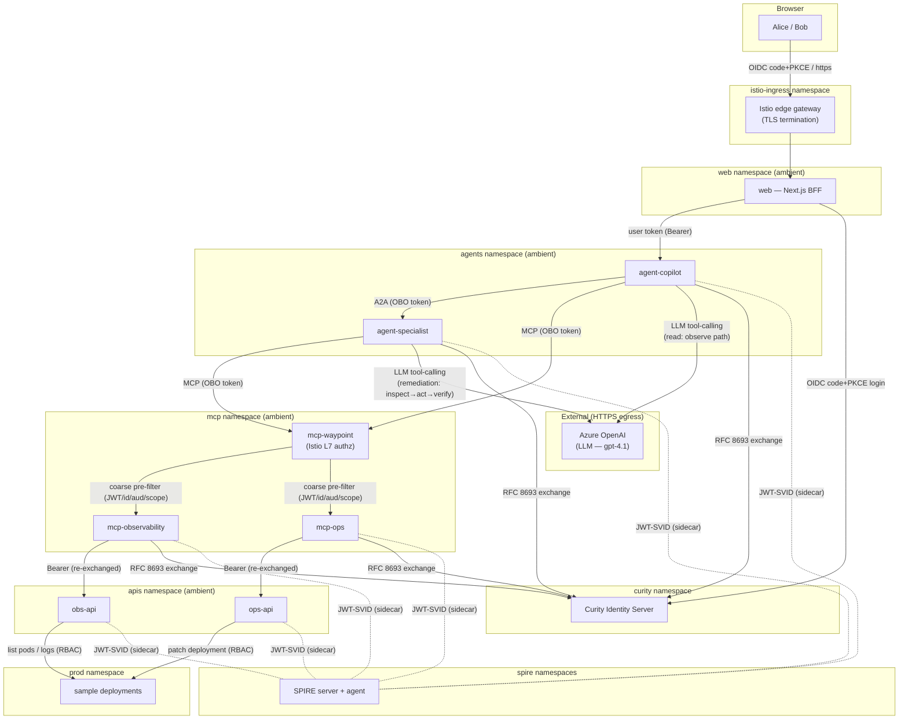
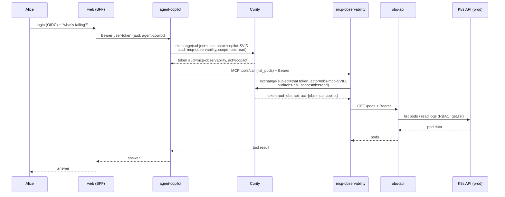
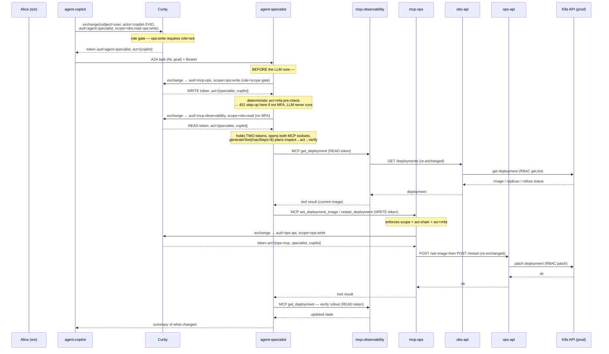
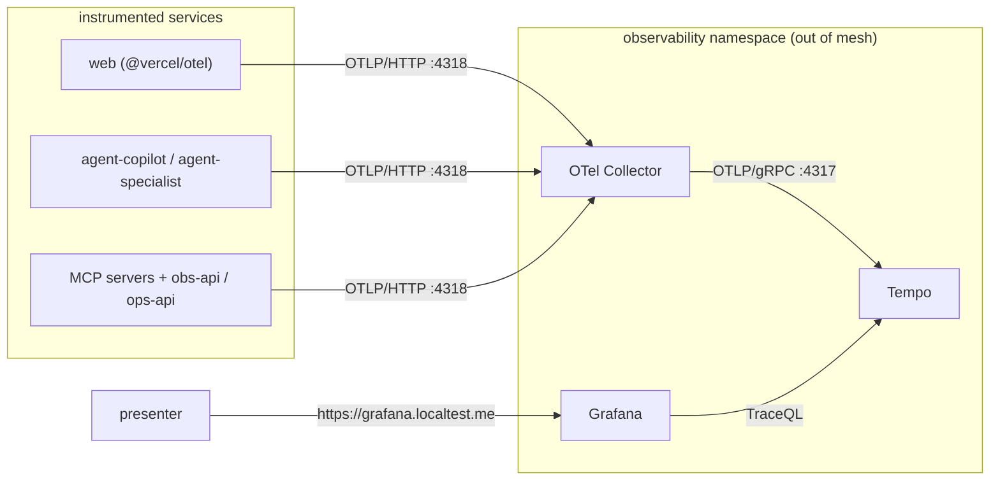

# Architecture

This document describes the **as-built** system: an end-to-end demonstration of
authentication and authorization for AI agents running on Kubernetes. It is the
canonical reference for *what exists and how the pieces fit together*. For
module-level implementation detail see [`design.md`](design.md); to run and
present the system see [`demo.md`](demo.md).

> The system was built up across pedagogical phases (1 → 6). Those phase notes
> live in [`archive/phases/`](archive/phases/) as a historical build-log; this
> document supersedes them for the current state.

---

## 1. What the system is

A DevOps/SRE **copilot**: a user asks an AI agent to investigate and remediate
an incident. The agent reads observability data and — for privileged actions —
delegates to a specialist agent that restarts workloads. Every hop is
authenticated and authorized, and the user's identity plus the full chain of
acting agents is provable at the resource that finally touches the cluster.

The demo's thesis: **three independent identity planes, enforced together.**

| Plane | Question it answers | Mechanism |
|---|---|---|
| **Human** | *On whose behalf?* | Curity OIDC user token → propagated as `sub` through every exchange |
| **Workload** | *Which software is acting?* | SPIFFE JWT-SVID per pod → presented as the `actor_token`; recorded in the nested `act` chain |
| **Assurance** | *How strongly did the human authenticate?* | `acr` claim (RFC 9470 step-up); privileged actions require `acr=mfa` |

These ride on top of Istio Ambient **mTLS** (transport identity) and Kubernetes
**RBAC** (what the final actor may touch). No single mechanism is trusted alone.

---

## 2. Component responsibilities

| Component | Namespace | Port | Responsibility |
|---|---|---|---|
| **web** | `web` | 3000 | Next.js BFF. OIDC login (Auth.js + Curity), httpOnly session cookie, forwards the user token to the copilot. The access token never reaches the browser. |
| **agent-copilot** | `agents` | 8081 | Front-line AI agent (Vercel AI SDK + Azure OpenAI). Validates the user token; exchanges it for hop-scoped tokens to call `mcp-observability` (read) or `agent-specialist` (privileged, over A2A). |
| **agent-specialist** | `agents` | 8082 | Privileged **LLM agent** (Vercel AI SDK + Azure OpenAI). Exposes an A2A endpoint that takes a natural-language remediation goal. Acquires *two* hop tokens — `ops:write` to `mcp-ops` and `obs:read` to `mcp-observability` — and runs a tool-using LLM loop to inspect, act, and verify (`get_deployment` to read; `restart_deployment`/`set_deployment_image`/`scale_deployment` to write). All authz gates fire **outside** the LLM loop: the `ops:write` exchange (role + scope gate) and the `acr=mfa` step-up pre-check both run **before** the model is ever invoked. |
| **mcp-observability** | `mcp` | 8080 | MCP server (Streamable HTTP), read tier. Validates the OBO token, then exchanges it again to call `obs-api`. Thin client — holds no data and no cluster credentials. |
| **mcp-ops** | `mcp` | 8080 | MCP server, privileged tier. Validates the OBO token (incl. step-up), then exchanges it to call `ops-api`. Thin client. |
| **obs-api** | `apis` | 8084 | Resource server backing the read tier. Validates the token (accepting **two** actor chains — copilot reading directly, or specialist reading while remediating), then reads pods/logs and deployment state from the `prod` namespace via its own narrowly-scoped Kubernetes RBAC (`get,list` on pods and deployments). |
| **ops-api** | `apis` | 8083 | Resource server backing the privileged tier. Validates the token (full actor chain + step-up), then `patch`es deployments in `prod` via its own RBAC. |
| **Curity Identity Server** | `curity` | 8443 | The **sole** token issuer. OIDC for the user; RFC 8693 token exchange for every agent/MCP hop; hosts the SPIFFE-aware token-exchange procedure. |
| **SPIRE** (server/agent/CSI) | `spire*` | — | Issues and rotates SPIFFE JWT-SVIDs (5-minute TTL) to every workload via a `spiffe-helper` sidecar. |
| **Istio Ambient** (ztunnel/cni/istiod) | `istio-system` | — | Transparent ztunnel L4 mTLS for all in-mesh traffic. |
| **Istio edge gateway** | `istio-ingress` | 80/443 | Terminates TLS for `app`/`curity`/`grafana`, the two agents' CIMD hosts (`copilot`/`specialist`), and the two MCP hosts (`mcp-ops`/`mcp-observability`, so their RFC 9728 metadata is browsable); the single ingress into the cluster. |
| **mcp-waypoint** (Istio L7 waypoint) | `mcp` | 15008 | Ambient L7 Envoy in front of both MCP Services. Coarse early-deny: valid Curity JWT (keys fetched live via `jwksUri`) + expected caller SPIFFE identity + audience + scope. Additive defense-in-depth — does *not* enforce the `act` chain or step-up (those stay in the resource-server middleware). |
| **OTel Collector → Tempo → Grafana** | `observability` | — | Distributed tracing. Identity attributes ride on the spans so the whole OBO chain is visible in one trace. |
| **prod** sample workloads | `prod` | — | The deployments the copilot observes and restarts (e.g. a CrashLoopBackOff target). |

The two MCP servers (`mcp-observability`, `mcp-ops`) are **thin clients**: they
authenticate the caller and re-exchange the token to a backend resource server
(`obs-api`, `ops-api`). The backend servers live in their own `apis` namespace —
separate from the thin clients in `mcp` — and are the only components holding
Kubernetes API credentials, each bound to a minimal RBAC Role in the `prod`
namespace.

---

## 3. Deployment topology

The arrows above are the request/OBO flow. The edge gateway also terminates TLS
for the `curity`, `copilot`/`specialist` (CIMD), and `mcp-ops`/`mcp-observability`
hosts purely so their discovery/`.well-known` documents (Curity OIDC metadata, the
agents' CIMD metadata + JWKS, the MCP servers' RFC 9728 protected-resource
metadata) are reachable over a trusted TLS cert. Those are *metadata* paths — the
actual agent→MCP→API calls stay in-mesh over ztunnel mTLS, never through the edge.

**LLM calls.** Both agents drive their tool-calling loops against **Azure OpenAI**
over HTTPS **egress** (out of cluster) — `agent-copilot` for the read/observe
path and `agent-specialist` for the privileged inspect→act→verify remediation.
These are the only calls that leave the cluster; no user or workload token is sent
to the LLM — the agents hold their MCP/API OBO tokens separately and only pass the
model tool *schemas* and the user's natural-language request.

**Mesh membership.** `web`, `agents`, `mcp`, and `apis` are enrolled in the Istio
Ambient dataplane (ztunnel L4 mTLS). `curity`, `spire*`, and `observability`
stay **out of mesh** by design: Curity
terminates external TLS and must keep a stable discovery URL; SPIRE and the
observability stack are infrastructure, not demo workloads.

**Trust domain.** All workload identities live under
`spiffe://demo.curity.local`, with IDs of the form
`spiffe://demo.curity.local/ns/<namespace>/sa/<serviceaccount>`.

---

## 4. The two delegation chains

Every agent/MCP hop performs an **RFC 8693 token exchange** against Curity,
presenting its SPIFFE JWT-SVID as the `actor_token`. Curity narrows the scope
and audience and nests the calling workload into the token's `act` claim. The
result is a per-hop token that (a) is only valid at the next audience, (b)
carries only the scopes that audience accepts, and (c) records the entire chain
of acting workloads.

The caller authenticates to Curity differently per tier. The two **agents** are
**CIMD ephemeral clients** (Client ID Metadata Documents): their `client_id` is a
self-hosted HTTPS URL Curity dereferences for a metadata document + JWKS, and they
authenticate with an asymmetric **`private_key_jwt`** assertion — no shared client
secret. The **MCP servers** remain static `client_secret_basic` clients. Either way,
the `actor_token` (SPIFFE JWT-SVID) and the `act`-chain enforcement are identical.

### 4.1 Read path (observability)

### 4.2 Privileged path (LLM remediation) — A2A + step-up

The copilot forwards the user's natural-language goal (e.g. *"roll order-service
back to v1.4 and restart it"*) to the specialist over A2A. The specialist is an
**LLM agent**: it acquires *both* an `ops:write` write token and an `obs:read`
read token up front, opens both MCP toolsets, and lets the model plan across
tiers — read current state, apply a write, re-read to verify. Crucially, the
authz gates run **before** the LLM: the write-token exchange (role + scope) and
the deterministic `acr=mfa` step-up pre-check both fire first, so an
unauthorized or un-stepped-up request is rejected without ever invoking the model.

If Alice authenticated with password only, the specialist's deterministic
pre-check (or `mcp-ops`) returns **401
`insufficient_user_authentication`** with `acr_values=mfa`; the web app drives
an MFA step-up at Curity, and the retried request carries `acr=mfa`. If
**Bob** (no `sre` role) attempts the same, Curity's procedure denies the very
first exchange with `access_denied` — strong authentication (he can MFA) is not
the same as authorization (he lacks the role).

---

## 5. Trust relationships

| Relying party | Trusts | Verifies via |
|---|---|---|
| Browser | Istio edge gateway TLS | mkcert local CA |
| web / agents / MCP / APIs | Curity-issued JWTs | Curity JWKS (signature, `iss`, `aud`, `exp`, scope) |
| Curity (token exchange) | SPIFFE JWT-SVIDs as `actor_token` | embedded **SPIRE JWKS** snapshot (verified with jose4j inside the procedure) |
| Curity (client auth) | the two agents' published signing keys | each agent's self-hosted **CIMD** metadata doc + JWKS, fetched over the mkcert-trusted gateway, used to verify the `private_key_jwt` assertion |
| Curity | the user | OIDC login (HTML form + TOTP) |
| Each resource server | the OBO actor chain | per-position SPIFFE-ID regex over the nested `act` claim |
| ztunnel (Ambient) | peer workloads | Istio mTLS (istiod-issued certs — a distinct trust domain from SPIRE, but the same shared root) |
| obs-api / ops-api | their own right to touch the cluster | Kubernetes RBAC — a Role/RoleBinding in `prod` bound to their `apis`-namespace ServiceAccounts |

**Two identity systems at different layers, one shared root of trust.** Istio
Ambient's mTLS uses istiod-issued workload certs for *transport* identity
(trust domain `cluster.local`); SPIRE issues JWT-SVIDs used as *application-layer*
`actor_token`s in the OAuth exchange (trust domain `demo.curity.local`). The two
trust domains are deliberately separate — but both CAs are **intermediates signed
by one cluster root**: istiod via the Istio plug-in CA (`cacerts`), SPIRE via its
`disk` UpstreamAuthority. So every X.509 in the cluster — transport certs and
X.509-SVIDs alike — chains to a single root, while the layers stay cleanly apart.

> *Why a shared root rather than SPIRE issuing Istio's certs directly?* In Istio
> **Ambient**, ztunnel obtains workload certs from istiod; consuming SPIRE-issued
> certs directly is a Solo.io enterprise feature, not upstream OSS. The shared-root
> pattern is the OSS-reachable way to get one trust anchor across both planes.

---

## 6. Security boundaries

The system fails closed at multiple independent gates. Each resource server runs
the same middleware shape (`apps/{mcp-ops,ops-api,…}/src/auth-middleware.ts`):

| Gate | Read tier (`mcp-observability` → `obs-api`) | Privileged tier (`mcp-ops` → `ops-api`) |
|---|---|---|
| **Bearer present** | ✅ | ✅ |
| **JWT valid** (sig/iss/aud/exp) | ✅ aud `mcp-observability` / `obs-api` | ✅ aud `mcp-ops` / `ops-api` |
| **Required scope** | `obs:read` | `ops:write` |
| **`act` chain present** | ✅ (no direct user call) | ✅ |
| **Exact chain length + order** | `[obs-mcp, copilot]` **or** `[obs-mcp, specialist, copilot]` (obs-api — multi-chain) | `[ops-mcp, specialist, copilot]` (ops-api) |
| **RFC 9470 step-up** (`acr=mfa`) | — (read is unprivileged) | ✅ at **both** hops (defense in depth) |
| **Role gate** (`sre` for `ops:write`) | — | ✅ enforced by Curity at exchange time |
| **Kubernetes RBAC** | `get`/`list` pods + pods/log **and** `get`/`list` deployments in `prod` | `patch` deployments in `prod` |

Boundary properties worth calling out:

- **Perimeter pre-filter (Istio L7 waypoint).** Before any request reaches the
  `mcp-ops`/`mcp-observability` pods, an Istio **ambient waypoint** in the `mcp`
  namespace (`k8s/istio/mcp-l7-authz.yaml`) does a *coarse* claims/identity check:
  valid Curity JWT (keys fetched live via `jwksUri`), expected caller **SPIFFE identity**
  (`agent-specialist` → mcp-ops; `agent-copilot` **and** `agent-specialist` →
  mcp-observability — the specialist reads deployment state while remediating),
  audience, and `scope`. A missing token is rejected **403** and a bad signature **401** at
  the network edge — the request never touches application code. This is *additive*
  defense-in-depth, **not** the security boundary: the waypoint cannot read the
  JSON-RPC body (so no per-tool gate) and deliberately does **not** enforce the
  `act` chain or step-up — those stay in the resource-server middleware below,
  because Istio's generic 403 cannot carry the RFC 9470 `WWW-Authenticate`
  challenge the step-up flow needs, nor match the nested `act.act.sub` chain.
  `forwardOriginalToken: true` keeps the Bearer flowing untouched to the pod.
- **Audience confinement.** Each exchanged token names exactly one audience.
  A token minted for `mcp-observability` is rejected by `mcp-ops` and vice-versa,
  so a leaked read-tier token cannot drive a write.
- **Scope-by-audience caps.** Curity's procedure keys allowed scopes *by
  audience*, so `agent-copilot` cannot obtain `ops:write` for the read-only
  `mcp-observability` audience even though it legitimately needs `ops:write`
  when forwarding to `agent-specialist`.
- **Chain integrity.** The nested `act` chain is pinned per position. A
  truncated or spliced chain (e.g. presenting a mid-chain token directly to a
  deeper server) fails the length/order check.
- **Least-privilege blast radius.** Only `obs-api`/`ops-api` hold cluster
  credentials, scoped to one namespace and a handful of verbs. Compromising a
  thin MCP server yields no standing cluster access.
---

## 7. Observability

Every service is OpenTelemetry-instrumented and exports OTLP to a Collector,
which forwards to Tempo; Grafana reads Tempo via TraceQL. A single user request
becomes **one distributed trace** spanning all hops, with two identity layers
stamped onto the spans.

| Layer | Attribute kind | Attributes | Source |
|---|---|---|---|
| **Human** | span attributes | `auth.sub`, `auth.scope`, `auth.acr`, `auth.aud`, `auth.roles`, `auth.act[]` | `decorateSpanWithIdentity()` in `packages/auth-curity`, stamped at JWT validation; `auth.act[]` grows along the chain |
| **Workload** | resource attribute | `spiffe.id` | `packages/otel-bootstrap`, read from the SVID file at SDK init |
| **Exchange** | span (`auth.token_exchange`) | `auth.exchange.audience`, `…scope`, `…client_id`, `…issued_scope` | `exchangeToken()` in `packages/auth-curity` |
| **MCP** | span attributes | `mcp.tool`, `mcp.resource_metadata_url` | the MCP `POST /` handler |

The six plain-Node services (both agents, both MCP servers, both backend APIs)
load `@ai-agents-demo/otel-bootstrap` via `node --import`; `apps/web` (Next
standalone, CommonJS) uses `@vercel/otel`.
Trace context propagates on the wire via a composite W3C + B3 propagator, so
the spans stitch into a single trace.

---

## 8. Standards used

| RFC / spec | Where it shows up |
|---|---|
| **OIDC / OAuth 2.0** | Curity issues the user token (code + PKCE) |
| **RFC 8693** token exchange | every agent/MCP hop; nested `act` per §4.1 |
| **CIMD** (Client ID Metadata Documents draft) + **RFC 7523** `private_key_jwt` | the two agents authenticate as ephemeral clients — `client_id` is a self-hosted metadata URL, auth is an asymmetric signed assertion |
| **SPIFFE / SPIRE** | per-workload JWT-SVID, presented as `actor_token` |
| **RFC 9470** step-up | `acr=mfa` required for `ops:write`; `WWW-Authenticate: insufficient_user_authentication` |
| **RFC 9728** protected-resource metadata | MCP/API `.well-known/oauth-protected-resource`, echoed in step-up challenges |

---

## See also

- [`design.md`](design.md) — module-level implementation reference.
- [`demo.md`](demo.md) — the end-to-end runbook and presenter script.
- [`curity-seed.md`](curity-seed.md) — offline Curity setup checklist.
