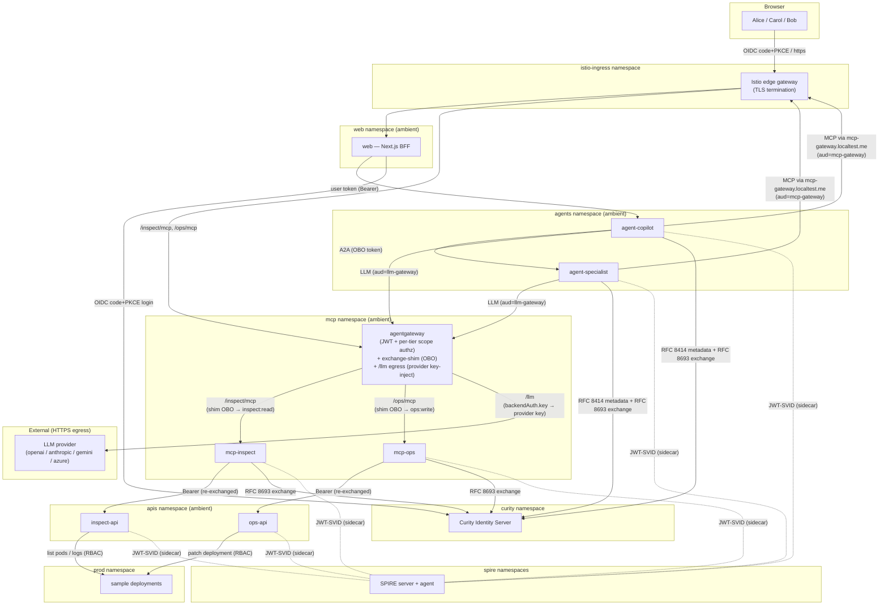
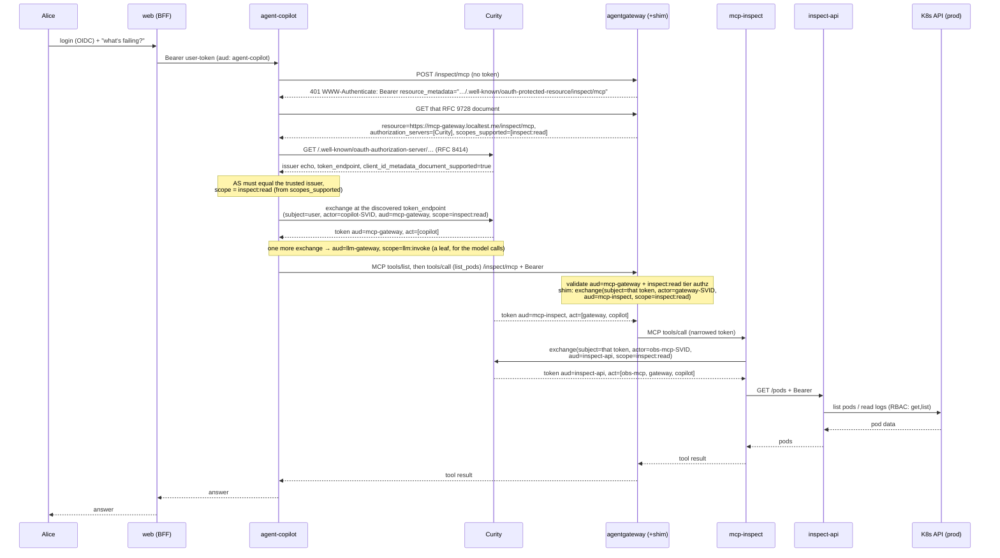
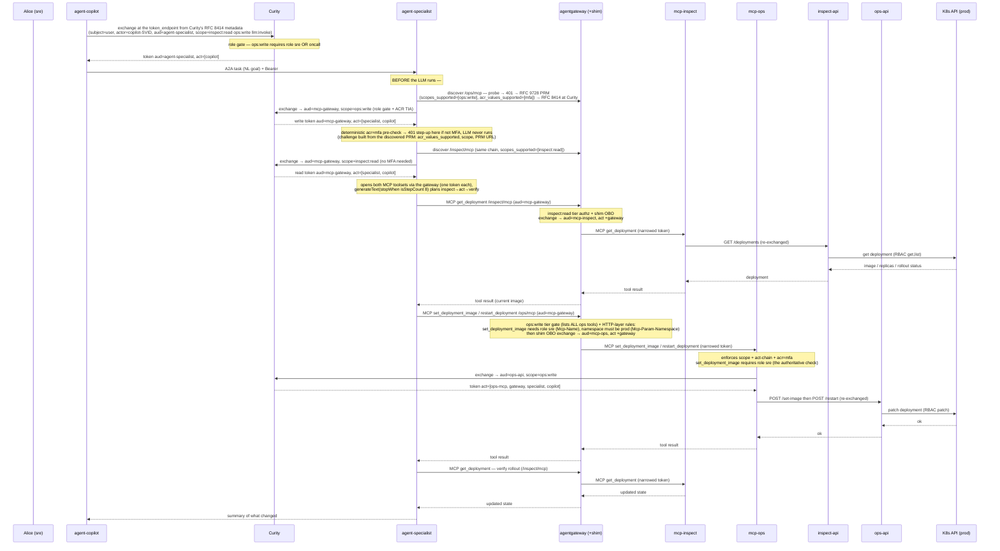
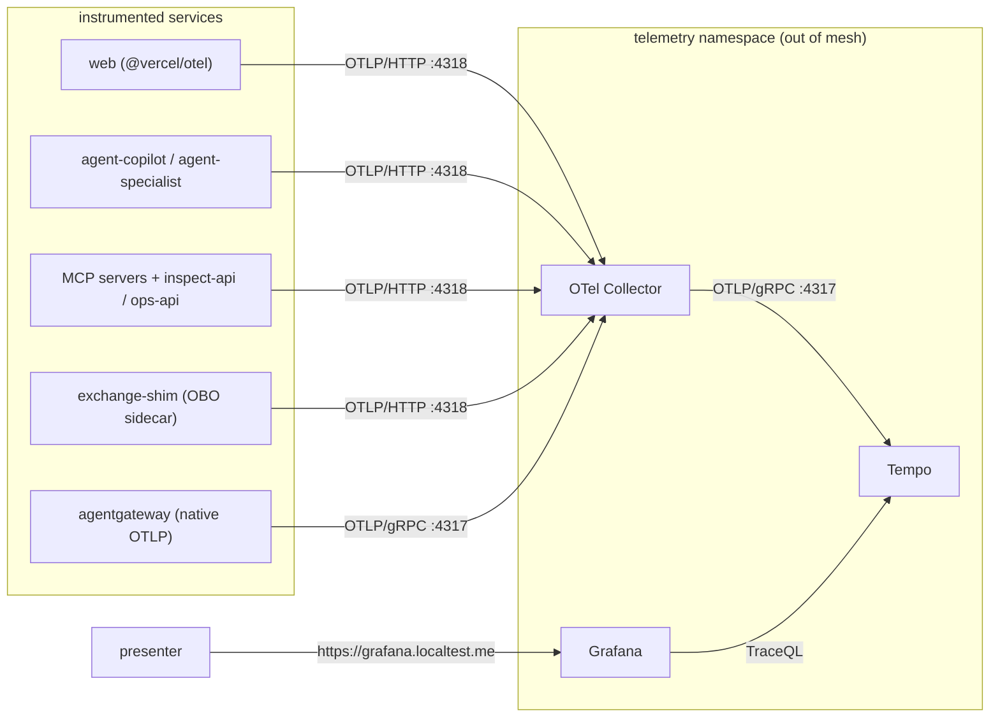

# Architecture

This document describes the **as-built** system: an end-to-end demonstration of
authentication and authorization for AI agents running on Kubernetes. It is the
canonical reference for *what exists and how the pieces fit together*. For
module-level implementation detail see [`design.md`](design.md); to run the
system see the [README](../README.md).

---

## 1. What the system is

A DevOps/SRE **copilot**: a user asks an AI agent to investigate and remediate
an incident. The agent reads observability data and — for privileged actions —
delegates to a specialist agent that restarts workloads. Every hop is
authenticated and authorized, and the user's identity plus the full chain of
acting agents is provable at the resource that finally touches the cluster.

The demo's thesis: **three independent identity planes, enforced together.**

| Plane | Question it answers | Mechanism |
|---|---|---|
| **Human** | *On whose behalf?* | Curity OIDC user token → propagated as `sub` through every exchange |
| **Workload** | *Which software is acting?* | SPIFFE JWT-SVID per pod → presented as the `actor_token`; recorded in the nested `act` chain |
| **Assurance** | *How strongly did the human authenticate?* | `acr` claim (RFC 9470 step-up); privileged actions require `acr=mfa` |

These ride on top of Istio Ambient **mTLS** (transport identity) and Kubernetes
**RBAC** (what the final actor may touch). No single mechanism is trusted alone.

---

## 2. Component responsibilities

| Component | Namespace | Port | Responsibility |
|---|---|---|---|
| **web** | `web` | 3000 | Next.js BFF. OIDC login (Auth.js + Curity), httpOnly session cookie, forwards the user token to the copilot. The access token never reaches the browser. Also serves the demo's visibility endpoints (`/api/obo-chain`, `/api/spiffe-identities`, `/api/tools`, and the `AUTH_DEBUG`-gated `/api/tokens`), which proxy the agents' debug routes with the session's token — see `design.md` §2 *Visibility surfaces*. |
| **agent-copilot** | `agents` | 8081 | Front-line AI agent (Vercel AI SDK) and a spec-shaped **MCP client**. Validates the user token. For a read it learns the MCP front door's authorization server, token endpoint and scope from the server itself (unauthenticated probe → 401 `resource_metadata` → RFC 9728 → RFC 8414; only the URL `https://mcp-gateway.localtest.me/inspect/mcp` and the RFC 8693 `audience` are configured) and exchanges for a hop-scoped `aud=mcp-gateway` token; for a privileged action it exchanges for an `agent-specialist` token (over A2A). Every model call is also a governed hop: it exchanges for `aud=llm-gateway`/`scope=llm:invoke` and drives its tool-calling loop against agentgateway's `/llm` route — never the LLM provider directly. |
| **agent-specialist** | `agents` | 8082 | Privileged **LLM agent** (Vercel AI SDK). Exposes an A2A endpoint that takes a natural-language remediation goal. Discovers each route's authorization server the same way the copilot does, then acquires **two** `aud=mcp-gateway` tokens — `ops:write` first (the role + scope gate), then `inspect:read` — and reaches both MCP servers **through the agentgateway** (`/ops/mcp` + `/inspect/mcp`), running a tool-using LLM loop to inspect, act, and verify (`get_deployment` to read; `restart_deployment`/`set_deployment_image`/`scale_deployment` to write). All authz gates fire **outside** the LLM loop: the `ops:write` exchange (role + scope gate) and the `acr=mfa` step-up pre-check both run **before** the model is ever invoked. Its RFC 9470 challenge is built from what discovery learned about the ops route (the PRM's `acr_values_supported`, the selected scope, the PRM URL), not from configuration. Like the copilot, its model calls are exchanged to `aud=llm-gateway`/`scope=llm:invoke` and routed through agentgateway's `/llm` route. |
| **mcp-inspect** | `mcp` | 8080 | MCP server (Streamable HTTP, revision 2026-07-28 only), read tier. Validates the OBO token, then exchanges it again to call `inspect-api`. Thin client — holds no data and no cluster credentials. |
| **mcp-ops** | `mcp` | 8080 | MCP server (same transport + revision as above), privileged tier. Validates the OBO token (incl. step-up), then exchanges it to call `ops-api`. Thin client. |
| **inspect-api** | `apis` | 8084 | Resource server backing the read tier. Validates the token (accepting **two** actor chains — copilot reading directly, or specialist reading while remediating), then reads pods/logs and deployment state from the `prod` namespace via its own narrowly-scoped Kubernetes RBAC (`get,list` on pods and deployments). |
| **ops-api** | `apis` | 8083 | Resource server backing the privileged tier. Validates the token (full actor chain + step-up), then `patch`es deployments in `prod` via its own RBAC. |
| **Curity Identity Server** | `curity` | 8443 | The **sole** token issuer. OIDC for the user; RFC 8693 token exchange for every agent/MCP hop; hosts the SPIFFE-aware token-exchange procedure. |
| **SPIRE** (server/agent/CSI) | `spire*` | — | Issues and rotates SPIFFE JWT-SVIDs (5-minute TTL) to every workload via a `spiffe-helper` sidecar. |
| **Istio Ambient** (ztunnel/cni/istiod) | `istio-system` | — | Transparent ztunnel L4 mTLS for all in-mesh traffic. |
| **Istio edge gateway** | `istio-ingress` | 80/443 | Terminates TLS for `app`/`curity`/`grafana`, the two agents' CIMD hosts (`copilot`/`specialist`), the two MCP hosts (`mcp-ops`/`mcp-inspect`, so their RFC 9728 metadata is browsable) and `mcp-gateway` (the MCP front door, which the agents call by that public name); the single ingress into the cluster. |
| **agentgateway** (+ co-located `exchange-shim`) | `mcp` | 8080 | The MCP front door for BOTH MCP servers, **and** the LLM egress gateway. Three path-scoped routes on one listener: `/inspect/mcp` → mcp-inspect, `/ops/mcp` → mcp-ops, `/llm` → the configured LLM provider. For MCP: answers unauthenticated calls with a 401 naming its per-route RFC 9728 document (`resource`, `scopes_supported`; the ops route adds `acr_values_supported`) — the document the agents discover the authorization server from — validates the caller's `aud=mcp-gateway` JWT, applies **coarse per-tier scope authz** (per-route `ops:write`/`inspect:read`) and filters `tools/list` by that tier scope. Its MCP-layer policy does *not* split ops tools by role (that would hide the tool from `tools/list`); two HTTP-layer `authorization` rules instead deny `set_deployment_image` without the `sre` role (keyed on `Mcp-Name`) and any explicit namespace other than `prod` (`Mcp-Param-Namespace`), with mcp-ops remaining the authoritative role check. For each tool-call it drives an `extAuthz` call to the co-located `exchange-shim` (`:8090`, same pod), which performs the RFC 8693 OBO exchange using the gateway's SPIFFE JWT-SVID as the `actor_token` and swaps the narrowed downstream token onto the request. Inserts one `act` position (`…/ns/mcp/sa/agentgateway`). Does *not* enforce the `act` chain or step-up (those stay in the resource-server middleware). For `/llm`: validates a separate `aud=llm-gateway` JWT, requires `llm:invoke`, and injects the **only** upstream LLM provider API key in the system (`backendAuth.key`) — no shim, no `act`-chain (the provider is outside the trust domain, so there is no downstream workload to nest). The provider block is generated from `.demo.env`; see `llm-providers.md`. |
| **OTel Collector → Tempo → Grafana** | `telemetry` | — | Distributed tracing. Identity attributes ride on the spans so the whole OBO chain is visible in one trace. |
| **prod** sample workloads | `prod` | — | Two sample deployments, `order-service` and `checkout-service` (busybox), that the copilot observes and the specialist restarts, scales or re-images. |

> **Naming: one workload, two OAuth roles.** The gateway appears under two names on
> purpose, and they answer different questions. **`agentgateway`** is the *workload* —
> one pod, one Kubernetes ServiceAccount, and therefore one SPIFFE ID
> (`spiffe://demo.curity.local/ns/mcp/sa/agentgateway`, derived mechanically from the
> SA by SPIRE). That is the name you see in every `act` chain, because `act` records
> which *workload* acted. **`mcp-gateway`** and **`llm-gateway`** are *audiences* —
> the two OAuth roles that single workload plays (MCP front door, LLM egress). That is
> why a token can read `aud=mcp-gateway` while the chain reads
> `act: … ▸ agentgateway`: same box, different question. The split is deliberate —
> workload identity is attested by SPIRE from pod attributes, whereas the OAuth role is
> asserted by Curity from configured policy, and the demo's whole argument is that these
> are two independent facts stapled together at each hop. Renaming the SPIFFE ID to
> `mcp-gateway` would be wrong, not merely churn: it would deny that the same workload
> also fronts `llm-gateway`.

The two MCP servers (`mcp-inspect`, `mcp-ops`) are **thin clients**: they
authenticate the caller and re-exchange the token to a backend resource server
(`inspect-api`, `ops-api`). The backend servers live in their own `apis` namespace —
separate from the thin clients in `mcp` — and are the only components holding
Kubernetes API credentials, each bound to a minimal RBAC Role in the `prod`
namespace.

---

## 3. Deployment topology



The arrows above are the request/OBO flow. The edge gateway also terminates TLS
for the `curity`, `copilot`/`specialist` (CIMD), `mcp-ops`/`mcp-inspect` and
`mcp-gateway` hosts. For Curity, the agents and the two origin MCP servers that is
purely so their discovery/`.well-known` documents are reachable over a trusted TLS
cert. For `mcp-gateway.localtest.me` it is more: the agents CALL the MCP front door
by that name, because they are spec-shaped MCP clients that discover the
authorization server from the gateway's own RFC 9728 document, and RFC 9728 has
the client check that the document's `resource` equals the URL it uses. The
agent→gateway hop therefore enters through the edge; the gateway→MCP→API hops stay
in-mesh over ztunnel mTLS.

**LLM calls.** Both agents drive their tool-calling loops against an **LLM
provider**, but neither calls it directly. Each exchanges the user's access token
(subject) + its SPIFFE JWT-SVID (actor) for a token scoped `aud=llm-gateway`,
`scope=llm:invoke`, and calls **agentgateway's** OpenAI-compatible `/llm` route
with that token as the bearer. The gateway validates the JWT, checks
`llm:invoke`, and injects the real provider API key upstream
(`backendAuth.key`) — it is the **only** place that credential lives; the
egress from the cluster happens at the gateway, not the agent pods. Which
provider answers is generated from `.demo.env` into the gateway's config
(`openai` / `anthropic` / `gemini` / `azure`) and changes nothing above — see
[`llm-providers.md`](llm-providers.md).
This is a single RFC 8693 exchange with **no `exchange-shim` hop and no
`act`-chain enforcement**: the provider sits outside the Curity/SPIFFE trust domain, so
there is no downstream workload identity to nest — it's a one-hop credential
swap, not a delegation chain. `agent-copilot` uses it for the read/observe path;
`agent-specialist` for the privileged inspect→act→verify loop.

**Mesh membership.** `web`, `agents`, `mcp`, and `apis` are enrolled in the Istio
Ambient dataplane (ztunnel L4 mTLS). `curity`, `spire*`, and `telemetry`
stay **out of mesh** by design: Curity
terminates external TLS and must keep a stable discovery URL; SPIRE and the
telemetry stack are infrastructure, not demo workloads.

**Trust domain.** All workload identities live under
`spiffe://demo.curity.local`, with IDs of the form
`spiffe://demo.curity.local/ns/<namespace>/sa/<serviceaccount>`.

---

## 4. The two delegation chains

Every agent/MCP hop performs an **RFC 8693 token exchange** against Curity,
presenting its SPIFFE JWT-SVID as the `actor_token`. Curity narrows the scope
and audience and nests the calling workload into the token's `act` claim. The
result is a per-hop token that (a) is only valid at the next audience, (b)
carries only the scopes that audience accepts, and (c) records the entire chain
of acting workloads.

The caller authenticates to Curity differently per tier. The two **agents** are
**CIMD ephemeral clients** (Client ID Metadata Documents): their `client_id` is a
self-hosted HTTPS URL Curity dereferences for a metadata document + JWKS, and they
authenticate with an asymmetric **`private_key_jwt`** assertion — no shared client
secret. The **MCP servers** remain static `client_secret_basic` clients. Either way,
the `actor_token` (SPIFFE JWT-SVID) and the `act`-chain enforcement are identical.

**On the MCP hops, *where* to exchange is discovered, not configured.** Both
agents are spec-shaped MCP clients (MCP 2026-07-28, *Authorization*): the only
static per-server inputs are the server URL and the RFC 8693 `audience`. The
authorization server, its token endpoint and the scope to request all come from
the server. An unauthenticated probe answers 401 with `resource_metadata`; the
RFC 9728 document there must name the exact URL the agent calls as its `resource`
and lists `authorization_servers`; that server's RFC 8414 metadata must echo its
issuer, advertise `client_id_metadata_document_supported` (the agents can register
no other way) and expose an HTTPS `token_endpoint`; the scope is the challenge's
`scope` if present, else the PRM's `scopes_supported` (agentgateway's challenge
carries none, so it is the latter). The discovered server must equal the Curity
issuer the agent already trusts, or discovery fails closed — a compromised front
door cannot redirect the user's delegated token elsewhere. A failure to *learn* the
authorization server surfaces as `502 mcp_unavailable`; a refusal *by* it as `403`.
The non-MCP hops (A2A delegation, LLM egress) have no server to discover from, so
they use the configured issuer — but still read the token endpoint from its RFC
8414 metadata rather than from configuration. Module detail: `design.md` §2 *How
an agent learns where to get its MCP token*.

### 4.1 Read path (inspect)



### 4.2 Privileged path (LLM remediation) — A2A + step-up

The copilot forwards the user's natural-language goal (e.g. *"roll order-service
back to v1.4 and restart it"*) to the specialist over A2A. The specialist is an
**LLM agent**: it acquires *both* an `ops:write` write token and an `inspect:read`
read token up front, opens both MCP toolsets, and lets the model plan across
tiers — read current state, apply a write, re-read to verify. Crucially, the
authz gates run **before** the LLM: the write-token exchange (role + scope) and
the deterministic `acr=mfa` step-up pre-check both fire first, so an
unauthorized or un-stepped-up request is rejected without ever invoking the model.



If Alice (`[sre]`) authenticated with password only, the specialist's
deterministic pre-check (or `mcp-ops`) returns **401
`insufficient_user_authentication`** with `acr_values=mfa`; the web app drives
an MFA step-up at Curity, and the retried request carries `acr=mfa`. If
**Bob** (`[developer]`, no `ops:write` role) attempts the same, Curity's procedure
denies the very first exchange with `access_denied` — strong authentication (he
can MFA) is not the same as authorization (he lacks the role). The `ops:write`
role gate accepts `sre` **or** `oncall`; that gate makes
`restart_deployment`/`scale_deployment` available to any `ops:write` caller
(`oncall` or `sre`). The finer `set_deployment_image` = `sre`-only split is
enforced twice: by an HTTP-layer `authorization` rule at the gateway (keyed on the
`Mcp-Name` header, so the tool stays *listed*) and, authoritatively, at `mcp-ops`
— the gateway rule fails open when the `roles` claim is absent. So **Carol**
(`[oncall]`, after the same step-up) can restart or scale, and *sees*
`set_deployment_image` in `tools/list` (mcp-ops publishes the required roles in
the tool's `_meta`, so the UI can say "listed, not callable"), but the call is
refused with a 403 that the specialist relays as a factual denial rather than a
guess about who lacked permission.

---

## 5. Trust relationships

| Relying party | Trusts | Verifies via |
|---|---|---|
| Browser | Istio edge gateway TLS | mkcert local CA |
| web / agents / MCP / APIs | Curity-issued JWTs | Curity JWKS (signature, `iss`, `aud`, `exp`, scope) |
| Curity (token exchange) | SPIFFE JWT-SVIDs as `actor_token` | **SPIRE's JWKS fetched at runtime** from the SPIRE OIDC Discovery Provider, verified inside the procedure (refetched on an unknown `kid`, so key rotation self-heals) |
| Curity (client auth) | the two agents' published signing keys | each agent's self-hosted **CIMD** metadata doc + JWKS, fetched over the mkcert-trusted gateway, used to verify the `private_key_jwt` assertion |
| Curity | the user | OIDC login (HTML form + TOTP) |
| the two agents (as MCP clients) | the authorization server an MCP server names in its RFC 9728 document | only if it equals the Curity issuer the agent already trusts (`allowedAuthorizationServers`), is HTTPS, echoes its issuer in RFC 8414 metadata and advertises CIMD support — otherwise discovery fails closed and no token is sent anywhere |
| Each resource server | the OBO actor chain | per-position SPIFFE-ID regex over the nested `act` claim |
| ztunnel (Ambient) | peer workloads | Istio mTLS (istiod-issued certs — a distinct trust domain from SPIRE, but the same shared root) |
| `apis-waypoint` (Istio ambient L7, in front of `inspect-api`/`ops-api`) | the calling MCP server's **mesh** identity + the Curity JWT | `RequestAuthentication` (Curity JWKS) + per-Service `AuthorizationPolicy` pinning `source.principals` to `cluster.local/ns/mcp/sa/mcp-inspect` / `mcp-ops` and the token's audience + scope (`k8s/istio/apis-l7-authz.yaml`) — the one place an mTLS identity, not a JWT claim, is an authz input |
| inspect-api / ops-api | their own right to touch the cluster | Kubernetes RBAC — a Role/RoleBinding in `prod` bound to their `apis`-namespace ServiceAccounts |
| agentgateway (`/llm`) | the caller is a Curity-authorized human-on-behalf-of request | `aud=llm-gateway` JWT + `llm:invoke` scope — **not** an actor chain, since the request terminates at the LLM provider rather than another workload |
| LLM provider | the request came from agentgateway | a static API key (`backendAuth.key`) injected only at the gateway; the agents never possess it |

**Two identity systems at different layers, one shared root of trust.** Istio
Ambient's mTLS uses istiod-issued workload certs for *transport* identity
(trust domain `cluster.local`); SPIRE issues JWT-SVIDs used as *application-layer*
`actor_token`s in the OAuth exchange (trust domain `demo.curity.local`). The two
trust domains are deliberately separate — but both CAs are **intermediates signed
by one cluster root**: istiod via the Istio plug-in CA (`cacerts`), SPIRE via its
`disk` UpstreamAuthority. So every X.509 in the cluster — transport certs and
X.509-SVIDs alike — chains to a single root, while the layers stay cleanly apart.

> *Why a shared root rather than SPIRE issuing Istio's certs directly?* In Istio
> **Ambient**, ztunnel obtains workload certs from istiod; consuming SPIRE-issued
> certs directly is a Solo.io enterprise feature, not upstream OSS. The shared-root
> pattern is the OSS-reachable way to get one trust anchor across both planes.

---

## 6. Security boundaries

The system fails closed at multiple independent gates. Each resource server runs
the same middleware shape (`apps/{mcp-ops,ops-api,…}/src/auth-middleware.ts`):

| Gate | Read tier (`mcp-inspect` → `inspect-api`) | Privileged tier (`mcp-ops` → `ops-api`) |
|---|---|---|
| **Bearer present** | ✅ | ✅ |
| **JWT valid** (sig/iss/aud/exp) | ✅ aud `mcp-inspect` / `inspect-api` | ✅ aud `mcp-ops` / `ops-api` |
| **Required scope** | `inspect:read` | `ops:write` |
| **`act` chain present** | ✅ (no direct user call) | ✅ |
| **Exact chain length + order** | `[obs-mcp, agentgateway, copilot]` **or** `[obs-mcp, agentgateway, specialist, copilot]` (inspect-api — multi-chain) | `[ops-mcp, agentgateway, specialist, copilot]` (ops-api) |
| **RFC 9470 step-up** (`acr=mfa`) | — (read is unprivileged) | ✅ at **both** hops (defense in depth) |
| **Role gate** (`sre`/`oncall` for `ops:write`) | — | ✅ Curity gates `ops:write` on `sre` OR `oncall` at exchange time; the finer `set_deployment_image` = `sre`-only split is denied first by the gateway's HTTP-layer `authorization` rule (`Mcp-Name`, fails open without a `roles` claim) and authoritatively at **mcp-ops** |
| **Kubernetes RBAC** | `get`/`list` pods + pods/log **and** `get`/`list` deployments in `prod` | `patch` deployments in `prod` |

Boundary properties worth calling out:

- **MCP front door (agentgateway + exchange-shim).** Before any request reaches the
  `mcp-ops`/`mcp-inspect` pods, the standalone **agentgateway** in the `mcp`
  namespace (`k8s/workloads/agentgateway-config.yaml`) validates the caller's
  `aud=mcp-gateway` JWT (keys fetched live from Curity's in-cluster JWKS URL) and
  does **coarse tier authorization** — the `/ops/mcp` route requires `ops:write`,
  the `/inspect/mcp` route requires `inspect:read` — filtering `tools/list` by
  that tier scope and denying calls that fall outside the caller's scope/identity.
  Its MCP-layer policy deliberately does **not** split ops tools by role: it lists
  *all* ops tools (`restart_deployment`/`scale_deployment`/`set_deployment_image`)
  for any `ops:write` caller, because agentgateway couples `tools/list` visibility
  to that policy, and hiding `set_deployment_image` from an `oncall` caller would
  make the specialist LLM loop silently rather than surface a denial. The role
  split runs instead in the HTTP-layer `authorization` policy, which takes no part
  in `tools/list`: `set_deployment_image` is denied without the `sre` role (keyed
  on the `Mcp-Name` header) and any explicit namespace other than `prod` is refused
  (`Mcp-Param-Namespace`, SEP-2243). That rule fails open if the `roles` claim is
  missing, so `mcp-ops` remains the authoritative check; and a gateway denial is a
  bare 403, which the agents' toolset adapter turns back into a factual tool result
  so the model relays a refusal instead of inventing one. The gateway also serves
  the RFC 9728 document each route's 401 points to — the document the agents
  discover the authorization server from. It is
  path-routed — `/inspect/mcp` → mcp-inspect, `/ops/mcp` → mcp-ops —
  because agentgateway (re-verified on v1.4.1) does not expose `mcp.tool.target` in its `extAuthz`
  CEL scope, so per-backend audience narrowing can't be done on a single federated
  endpoint. For each tool-call the gateway drives an `extAuthz` call to the
  co-located **exchange-shim** (`apps/exchange-shim`, same pod), which performs the
  RFC 8693 OBO exchange — presenting the gateway's SPIFFE JWT-SVID as `actor_token`,
  the caller's token as subject, and a **server-derived** per-backend audience/scope
  (from an allow-list, never caller-supplied) — and hands back the narrowed token the
  gateway swaps onto the request. This inserts one `act` position
  (`…/ns/mcp/sa/agentgateway`). It deliberately does **not** enforce the `act`
  chain or step-up — those stay in the resource-server middleware below, because the
  gateway's generic deny cannot carry the RFC 9470 `WWW-Authenticate` challenge the
  step-up flow needs, nor match the nested `act.act.sub` chain (the step-up 401 still
  originates at mcp-ops/ops-api and passes back through the gateway).
- **apis-tier waypoint (caller-identity pinning).** `inspect-api` and `ops-api` opt
  into an Istio ambient waypoint (`istio.io/use-waypoint: apis-waypoint`,
  `k8s/istio/apis-l7-authz.yaml`). It validates the Curity JWT and does a coarse
  default-deny: each API accepts only connections whose **mTLS peer identity** is
  the one MCP server that fronts it, presenting a token with that API's audience
  and scope. The app only ever sees the Bearer token, never the mTLS peer, so this
  is enforceable only at the waypoint — it adds proof-of-possession of the *acting
  workload*, not of the token. The `act`
  chain and step-up stay in the app middleware for the same reason as at the MCP
  front door. This is why the Kubernetes Gateway API CRDs are still installed:
  this waypoint is their only remaining consumer.
- **Authorization-server pinning at the MCP client.** The agents *discover* the
  authorization server from the front door's RFC 9728 document, but will only
  exchange with the Curity issuer they already trust: a document naming any other
  server, a non-https server, or a non-https `resource_metadata` URL fails closed.
  Discovery is what makes the client spec-shaped; the pin is what stops a
  compromised front door from redirecting the user's delegated token to a foreign
  server that merely advertises CIMD support.
- **Can't-learn is not won't-issue.** A failure to discover the authorization
  server (`discovery_failed`, `resource_mismatch`, `cimd_unsupported`,
  `scope_unavailable`) is answered as `502 mcp_unavailable`; a refusal by Curity as
  `403` carrying its error code. The two are never collapsed, so an outage cannot
  read as a denial, nor a denial as an outage.
- **LLM egress gateway (agentgateway `/llm`).** The LLM provider sits outside the
  Curity/SPIFFE trust domain, so there is no downstream workload to nest into an
  `act` chain — this route is a single upstream credential swap, not a
  delegation hop. Each agent exchanges the user token (subject) + its SPIFFE
  SVID (actor) once for `aud=llm-gateway`/`scope=llm:invoke`; agentgateway
  validates that JWT and `llm:invoke` before the request ever leaves the cluster,
  and is the only place the real provider API key lives (`backendAuth.key`) — the
  agents never hold it. This boundary is identical whichever provider is
  configured; only the fragment supplying `backendAuth`/`backends` changes.
- **Audience confinement.** Each exchanged token names exactly one audience.
  A token minted for `mcp-inspect` is rejected by `mcp-ops` and vice-versa,
  so a leaked read-tier token cannot drive a write.
- **Scope-by-audience caps.** Curity's procedure keys allowed scopes *by
  audience*, so `agent-copilot` cannot obtain `ops:write` for the read-only
  `mcp-inspect` audience even though it legitimately needs `ops:write`
  when forwarding to `agent-specialist`.
- **Chain integrity.** The nested `act` chain is pinned per position. A
  truncated or spliced chain (e.g. presenting a mid-chain token directly to a
  deeper server) fails the length/order check.
- **Least-privilege blast radius.** Only `inspect-api`/`ops-api` hold cluster
  credentials, scoped to one namespace and a handful of verbs. Compromising a
  thin MCP server yields no standing cluster access.
---

## 7. Telemetry (tracing)

Every service is OpenTelemetry-instrumented and exports OTLP to a Collector,
which forwards to Tempo; Grafana reads Tempo via TraceQL. A single user request
becomes **one distributed trace** spanning all hops, with two identity layers
stamped onto the spans.



| Layer | Attribute kind | Attributes | Source |
|---|---|---|---|
| **Human** | span attributes | `auth.sub`, `auth.scope`, `auth.acr`, `auth.aud`, `auth.roles`, `auth.act[]` | `decorateSpanWithIdentity()` in `packages/auth-curity`, stamped at JWT validation; `auth.act[]` grows along the chain |
| **Workload** | resource attribute | `spiffe.id` | `packages/otel-bootstrap`, read from the SVID file at SDK init |
| **Exchange** | span (`auth.token_exchange`) | `auth.exchange.audience`, `…scope`, `…client_id`, `…issued_scope`, `…token_endpoint` (plus `server.address` / `url.path`) | `exchangeToken()` in `packages/auth-curity` |
| **Gateway** | span attributes | `mcp.method.name`, `mcp.target`, `gen_ai.tool.name`, `gen_ai.usage.*`, `route`, `http.path`, `url.full`, `endpoint` (upstream, HTTP backends only) | agentgateway's native OTLP tracing (`config.tracing`) |
| **MCP** | span attributes | `mcp.tool`, `mcp.resource_metadata_url` | the MCP `POST /` handler |

The seven plain-Node services (both agents, both MCP servers, both backend APIs,
and the gateway's `exchange-shim` sidecar) load `@ai-agents-demo/otel-bootstrap`
via `node --import`; `apps/web` (Next standalone, CommonJS) uses `@vercel/otel`.
`agentgateway` itself exports natively (`config.tracing`), so the MCP/LLM front
door is a first-class hop rather than a gap between the agent and its backend.
MCP authorization discovery has no span of its own; it appears as the agent's
outbound HTTP client spans — `POST /inspect/mcp` answering 401,
`GET /.well-known/oauth-protected-resource/…`,
`GET /.well-known/oauth-authorization-server/…` — immediately before the
`auth.token_exchange` span they lead to (the demo pins the discovery cache to
zero so every question shows them).
The `net`/`dns`/`fs` auto-instrumentations are switched **off**
(`packages/otel-bootstrap/src/instrumentation-config.ts`): `tcp.connect` /
`tls.connect` were a third of a read-path waterfall and say nothing about
delegation. Connection failures still surface on the enclosing HTTP span.
Trace context propagates on the wire via a composite W3C + B3 propagator, so
the spans stitch into a single trace. agentgateway does not propagate context to
its `extAuthz` callout on its own, so each extAuthz block forwards `traceparent`
explicitly — that value is already the *gateway's own* span, which is what nests
the shim's exchange underneath it.

Every `/chat` response also carries the request's `traceId` (`activeTraceId()`
in `packages/auth-curity`, which reports nothing rather than 32 zeros when no
span is active), and the web UI's Result card deep-links it into Grafana Explore
on the Tempo datasource — the one-click route from an answer to its trace.

> **Reading the waterfall.** On the two MCP routes the origin span
> (`mcp-inspect` / `mcp-ops`) renders as a *sibling* of the agentgateway
> span rather than its child: agentgateway forwards the inbound `traceparent`
> verbatim on `mcp:` backends while rewriting it correctly for HTTP backends
> ([agentgateway#2904](https://github.com/agentgateway/agentgateway/issues/2904)).
> Durations still nest correctly — only the indentation misleads.

### 7.1 The OBO log (the log-plane view)

Traces are the analytic view; they need Grafana, and Tempo drops them after 30
minutes. Alongside them every service prints a human-readable block to stdout
for each of the five events in a delegation hop — inbound receipt (`RECEIVE`),
authorization-server discovery (`DISCOVER`, on the agents' MCP hops), token
exchange (`EXCHANGE`), call to the next hop (`CALL`), and **refusal** (`DENY`):

```
┌─ 2026-08-07T08:35:28.051Z INFO [agent-specialist] DENY → mcp-gateway
│  trace          : d5d000011850a56765d35750020540ff ▸ b30f1eceff0ab5f4
│  client_id      : https://specialist.localtest.me/.well-known/oauth-client
│  subject (sub)  : alice
│  subject act    : agent-copilot
│  actor (spiffe) : spiffe://demo.curity.local/ns/agents/sa/agent-specialist
│  scope req      : ops:write
│  error          : invalid_scope
│  reason         : invalid_scope no scope intersects subject + policy …
└─
```

The renderer is `packages/auth-curity/src/obo-log.ts`; `OBO_LOG=off` silences
it. Two properties make it useful rather than decorative:

- **It is joined to the trace plane by `trace`,** taken from the active span at
  emission. The same trace id appears in agentgateway's native request log
  (`trace.id=… span.id=… jwt.sub=alice`) and in Tempo, so a log line found by
  `kubectl logs` leads directly to the trace, and vice versa. The span id
  additionally distinguishes *which* unit of work emitted the line — the
  `EXCHANGE` blocks carry their own `auth.token_exchange` span id, distinct from
  the enclosing request. Because trace ids are constant across a whole trace,
  this correlation is unaffected by the `mcp:` backend mis-parenting noted above.
- **Refusals are logged, not just grants** (`DENY`). This is the plane where the
  authorization story is easiest to read live, and a chain that simply *stopped*
  would be indistinguishable from a crash. See §7.2.

A missing `trace` field is itself diagnostic: it means no active span, i.e. the
service is not instrumented — the failure mode of the ESM/OTel patching hazard
recorded in `CLAUDE.md` fact #28.

> The blocks are multi-line for terminal readability, so a log *collector* would
> split each `│` into its own record. Nothing ships these off-cluster today; if
> that changes, add an opt-in single-line JSON mode rather than flattening the
> default.

### 7.2 What a denial looks like

The pre-MFA half of a privileged request is the most instructive thing in the
logs, and it spans three blocks in one trace:

| When | Service | Block | What it shows |
|---|---|---|---|
| `…27.984` | `agent-copilot` | `EXCHANGE → agent-specialist` | `scope req: inspect:read ops:write llm:invoke` → `scope issued: inspect:read llm:invoke`. Curity narrows `ops:write` away **silently and successfully** — the copilot is *allowed to ask*, so this is not an error. |
| `…28.051` | `agent-specialist` | `DENY → mcp-gateway` | The same refusal, now fatal: the specialist actually needs `ops:write`, so Curity answers `invalid_scope`. This is the authorization server's verdict. |
| `…28.057` | `agent-specialist` | `DENY → mcp-ops (step-up required, RFC 9470)` | The agent's *response* to that verdict: `acr: html-form`, `acr required: mfa`. This is what becomes the browser's MFA prompt. |

The two `DENY` blocks 6ms apart are deliberate, not duplication: one is Curity
refusing, the other is the agent converting that refusal into a challenge.
Which component made which decision is the point.

Both are emitted from a **single exit per component** — `exchangeToken`'s
`catch`, and a wrapper around `runRemediation` — because a step-up has five
possible origins and a failed exchange six. Logging at each `throw`/`return`
site instead is what let the original gap exist: the refusal path simply
produced no output.

---

## 8. Standards used

| RFC / spec | Where it shows up |
|---|---|
| **OIDC / OAuth 2.0** | Curity issues the user token (code + PKCE) |
| **RFC 8693** token exchange | every agent/MCP hop, nested `act` per §4.1; also the single-hop LLM egress exchange (`aud=llm-gateway`), which does **not** nest `act` — the LLM provider has no downstream workload identity |
| **CIMD** (Client ID Metadata Documents draft) + **RFC 7523** `private_key_jwt` | the two agents authenticate as ephemeral clients — `client_id` is a self-hosted metadata URL, auth is an asymmetric signed assertion |
| **SPIFFE / SPIRE** | per-workload JWT-SVID, presented as `actor_token` |
| **RFC 9470** step-up | `acr=mfa` required for `ops:write`; `WWW-Authenticate: insufficient_user_authentication` |
| **RFC 8414** authorization-server metadata | the agents read Curity's `token_endpoint` and `client_id_metadata_document_supported` from `/.well-known/oauth-authorization-server/oauth/v2/oauth-anonymous`; nothing about the token endpoint is configured |
| **RFC 9728** protected-resource metadata | MCP/API `.well-known/oauth-protected-resource`, served by the origin servers AND by agentgateway per route (the gateway's carries `scopes_supported`, plus `acr_values_supported` on the ops route); advertised in every 401 (`resource_metadata`) and in step-up challenges; the agents discover the AS from it and check `resource` against the URL they call |
| **MCP authorization (2026-07-28)** | servers: 401/403 challenges with `resource_metadata` + `scope`, RFC 6750 codes; clients: discovery chain, scope-selection order, CIMD gating; the revision's `Mcp-Name` / `Mcp-Param-Namespace` (SEP-2243) headers are the inputs to agentgateway's `authorization` rules. Deviations: RFC 8707 `resource` deferred (Curity), grant is RFC 8693 not authorization-code, step-up is RFC 9470 |

---

## See also

- [`design.md`](design.md) — module-level implementation reference.
- [`README.md`](../README.md) — prerequisites, quick start, troubleshooting.
- [`curity-seed.md`](curity-seed.md) — offline Curity setup checklist.
